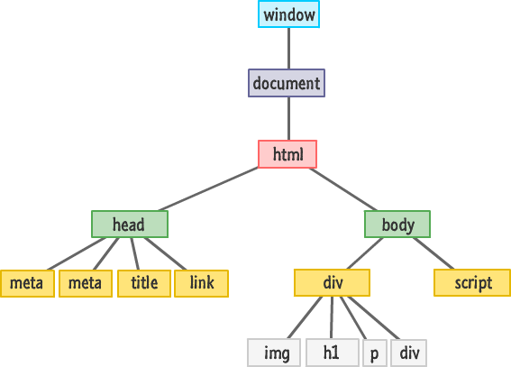

<div align="center">
  <h1>DOM</h1>
<sub>Author:
<a href="https://www.linkedin.com/in/bhuvanaganesan-l-2209047a" target="_blank">Bhuvan Ganesan</a><br>
</sub>
</div>

## DOM

In this section, we begin writing the DOM tree of an HTML document or file. DOM stands for Document Object Model. The structure of DOM is like a real one. It starts with an **html** root element, followed by head and body. The head and body are the immediate children of the root element **html**. There is a declaration before the root element.

### Declaration

There is a declaration before the root element. This declaration tells the browser that it is an HTML document. Therefore, the browser renders it as an HTML document should be rendered.

This is the code for declaring an HTML document. The declaration is not part of the DOM tree.

```html
<!DOCTYPE html>
```

### Root Element

The **HTML** element is the root of the DOM tree and parent element of **head** and **body**.
The attempt DOM must be enclosed by an HTML tag.

```html
<!DOCTYPE html>
<html></html>
```

The **html** tag with two children, head and body.

```html
<!DOCTYPE html>
<html>
  <head></head>
  <body>
    content goes here
  </body>
</html>
```

Create a folder on the desktop and give it any name you like. Every **HTML** file must end with an .html extension. And it's good to have at least one index.html file in a project, and resetting the file will have different names.

This is a simplified structure of DOM, which contains the elements html, head, title, body, h1.

```html
<!DOCTYPE html>
<html>
  <head>
    <title>Sample HTML</title>
  </head>
  <body>
    <h1 id="first-id">The Building Blocks of the web</h1>
  </body>
</html>
```

The DOM tree of the HTML above looks like the following diagram.



### Heading Elements

HTML is a markup language. We mark up a piece of content with an HTML tag and the browser renders it into a clean web page. The h1 tag means that a text is rendered in a large font size, by default a text of size 32px is created. We have h1 to h6 different tags to write titles in different font sizes. Pixel (px) is a unit to measure the size which is as small as a dot.

```html
<!DOCTYPE html>
<html>
  <head>
    <title>head tag</title>
  </head>
  <body>
    <h1>First level heading</h1>
    <h2>Second level heading</h2>
    <h3>Third level heading</h3>
    <h1>Fourth level heading</h1>
    <h4>Fifth level heading</h4>
    <h6>Sixth level heading</h6>
  </body>
</html>
```

The size of the h1 to h6 tags:

- h1 is 32px (2em)
- h2 is 24px (1.5em)
- h3 is 20.8px (1.3em)
- h4 is 16px (1em)
- h5 is 12.8px (0.8em)
- h6 is 11.2px (0.7em)

### Paragraph Element

Now, let's add paragraph to our web page using the _p_ tag.

```html
<!DOCTYPE html>
<html>
  <head>
    <title>paragraph tag</title>
  </head>
  <body>
    <h1 id="title-id">The Building Blocks of the web</h1>
    <p>
        Learn HTML and build websites and web
        applications
    </p>
  </body>
</html>
```
There are six elements in the HTML code above. An HTML element can have a parent element, a child element, and one or more siblings. The _html_ element is the root or parent of _head_ and _body_. _head_ and _body_ are children of the _html_ tag. _head_ and _body_ are siblings. The _title_ is the child of the _head_. The body has two children, h1 and p.

### Section Element

If we want to create a section for our page, we can use the div or section element. The section element has a semantic meaning.
Let us insert a div on the previous page.

```html
<!DOCTYPE html>
<html>
  <head>
    <title>Non Section tag</title>
  </head>
  <body>
    <div>
      <h1 id="title-id">The Building Blocks of the web</h1>
      <p>
        Learn HTML and build websites and web
        applications
      </p>
    </div>
  </body>
</html>
```
As you can see from the code above, all elements within the body are enclosed by a div.
Instead of div, a section can also be used

```html
<!DOCTYPE html>
<html>
  <head>
    <title>Section tag </title>
  </head>
  <body>
    <section>
      <h1 id="title-id">The Building Blocks of the web</h1>
      <p>
        Learn HTML and build websites and web
        applications
      </p>
    </section>
  </body>
</html>
```

### Header Section

Now, let us add header to our web page using the _header_ HTML tag.

```html
<!DOCTYPE html>
<html>
  <head>
    <title>header section</title>
  </head>
  <body>
    <header>HTML</header>
    <section>
      <h1 id="title-id">The Building Blocks of the web</h1>
      <p>
        Learn HTML and build websites and web
        applications
      </p>
    </section>
  </body>
</html>
```

Besides the header, we can add any kind of HTML element. However, I want to style the four letters of the HTML text. Therefore, I need to put them in a _span_ element.

```html
<!DOCTYPE html>
<html>
  <head>
    <title>30 Days Of HTML</title>
  </head>
  <body>
    <header>
      <span>H</span>
      <span>T</span>
      <span>M</span>
      <span>L</span>
    </header>
    <section>
      <h1 id="title-id">The Building Blocks of the web</h1>
      <p>
        Learn HTML and build websites and web
        applications
      </p>
    </section>
  </body>
</html>
```

### Main Section

Let's make use of the _main_ HTML tag to wrap all the content that will go to the main section.

```html
<!DOCTYPE html>
<html>
  <head>
    <title>30 Days Of HTML</title>
  </head>
  <body>
    <header>
      <span>H</span>
      <span>T</span>
      <span>M</span>
      <span>L</span>
    </header>
    <main>
      <section>
        <h1 id="title-id">The Building Blocks of the web</h1>
        <p>
          Learn HTML and build websites and
          web applications
        </p>
      </section>
    </main>
  </body>
</html>
```

### Footer Section

There is a _footer_ HTML tag to create a footer. Let us create a footer for the web page.

```html
<!DOCTYPE html>
<html>
  <head>
    <title>footer section</title>
  </head>
  <body>
    <header>
      <span>H</span>
      <span>T</span>
      <span>M</span>
      <span>L</span>
    </header>
    <main>
      <section>
        <h1 id="title-id">The Building Blocks of the web</h1>
        <p>
          There is not website without HTML. Learn HTML and build websites and
          web applications
        </p>
      </section>
    </main>
    <footer>Copyright @ Bhuvan Ganesan</footer>
  </body>
</html>
```

Instead of just throwing the text into the footer tag, we add a _small_ HTML tag to enclose the text, and it is converted to a small font size.

```html
<!DOCTYPE html>
<html>
  <head>
    <title>footer section</title>
  </head>
  <body>
    <header>
      <span>H</span>
      <span>T</span>
      <span>M</span>
      <span>L</span>
    </header>
    <main>
      <section>
        <h1 id="title-id">The Building Blocks of the web</h1>
        <p>
          There is not website without HTML. Learn HTML and build websites and
          web applications
        </p>
      </section>
    </main>
    <footer>
     <footer>Copyright @ Bhuvan Ganesan</footer>
    </footer>
  </body>
</html>
```

### Inline Style

We can apply CSS to an HTML element using inline styling.
Look at the figure below


We use the _style_ attribute to apply CSS to an HTML element.
For instance, let us apply style to h1.

```html
<h1 id="title-id" style="color:green">The Building Blocks of the web</h1>
```

We can add more CSS properties by separating with semicolons

```html
<h1 id="title-id" style="color:green;font-size:90px; background:blue;">
  The Building Blocks of the web
</h1>
```

As you can see from above code, _font-size_ and _background_ properties have been used.

Similarly let us apply style to the _span_ elements.

```html
<!DOCTYPE html>
<html>
  <head>
    <title>Inline Style</title>
  </head>
  <body>
    <header>
      <span style="color: #e34c26">H</span>
      <span style="color: #264de4">T</span>
      <span style="color: #f0db4f">M</span>
      <span style="color: #61dbfb">L</span>
    </header>
    <main>
      <section>
        <h1 id="title-id">The Building Blocks of the web</h1>
        <p>
          There is not website without HTML. Learn HTML and build websites and
          web applications
        </p>
      </section>
    </main>
    <footer>
     <footer>Copyright @ Bhuvan Ganesan</footer>
    </footer>
  </body>
</html>
```

Colors can be described by name, hexadecimal, RGB (red, green, blue) and HSL (hue, saturation, lightness).

There are about 1.67 million colors and it is difficult to describe them by names. There are about 140 colors that can be described with names and the rest of the colors can be described with hexadecimal, RGB or HSL. One form of color can be converted into another.

### Useful links
1. https://javascript.info/dom-nodes
2. https://developer.mozilla.org/en-US/docs/Web/API/Document_Object_Model/Introduction
